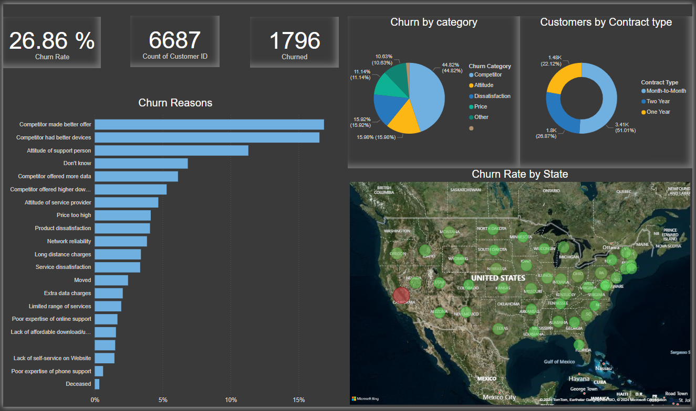

# **Analyzing Customer Churn**

### **Description**

This project analyzes the customer churn rate of a fictional telecommunications company called **Databel**. **Power BI** and **Jupyter Notebook** were used to perform a thorough analysis of the data, uncover important patterns related to customer churn, and propose strategies to improve customer retention.

- In the file `analyzing_customer_churn.pbix`, interactive dashboards were developed, along with calculated measures and columns for an initial exploratory analysis (EDA), which allowed for a deeper dive into the factors that impact customer churn.
- The file `final_analysis.pbix` contains the final analysis and conclusions visualized in an interactive dashboard based on the most relevant findings.

The full analysis, along with visualizations, is available at the following link:

<a href="notebooks/churn_analysis.ipynb" style="display: inline-block; padding: 10px 20px; font-size: 16px; font-weight: bold; color: white; background-color: #007bff; text-align: center; text-decoration: none; border-radius: 5px;">Detailed Results in Jupyter Notebook</a>

### **Objective**

- Determine the customer churn rate.
- Identify the main factors influencing customer loss.
- Propose recommendations to reduce the churn rate.

## **Key Insights**

1. **Competition as the Main Churn Factor:**  
   44.82% of customers who left did so due to better offers from competitors, representing the main cause of churn. This highlights the importance of improving competitive strategies.

2. **Age and Churn Rate:**  
   Customers over 80 years old have a churn rate of 52%, significantly higher than the average, indicating a possible disconnect between the services offered and the needs of this segment.

3. **Churn Rate in California:**  
   California has the highest churn rate (63.24%) despite having a low number of interactions with customer service. This finding suggests the need to further investigate the reasons behind this unusually high churn.

## **Contact**

If you have any questions or would like more information, feel free to contact me.

