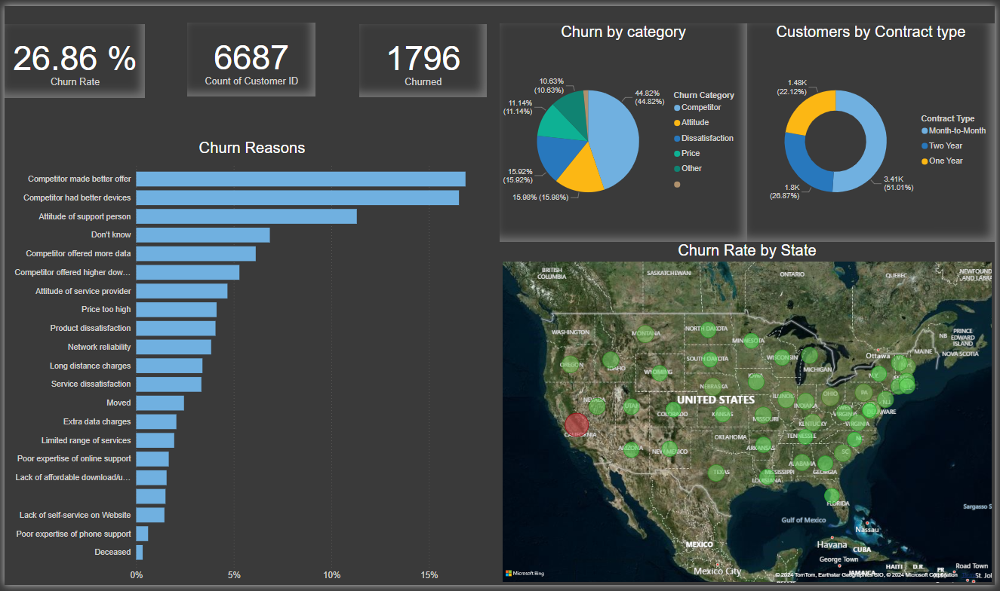

# **Análisis de la Pérdida de Clientes**

### **Descripción**

Este proyecto analiza la tasa de rotación de clientes de una empresa de telecomunicaciones ficticia llamada **Databel**. Se utilizó **Power BI** y **Jupyter Notebook** para realizar un análisis exhaustivo de los datos, descubrir patrones importantes relacionados con la pérdida de clientes y proponer estrategias para mejorar la retención de clientes.

- En el archivo `analyzing_customer_churn.pbix`, se desarrollaron dashboards interactivos, junto con medidas y columnas calculadas para un análisis exploratorio inicial (EDA), que permitió profundizar en los factores que impactan la pérdida de clientes.
- El archivo `final_analysis.pbix` contiene el análisis final y las conclusiones visualizadas en un dashboard interactivo basado en los hallazgos más relevantes.

El análisis completo, junto con las visualizaciones, se encuentra disponible en el siguiente enlace:

### **Objetivo**

- Determinar la tasa de rotación de clientes.
- Identificar los factores principales que influyen en la pérdida de clientes.
- Proponer recomendaciones para reducir la tasa de rotación.

## **Insights Clave**

1. **Competencia como Principal Factor de Rotación:**  
   El 44.82% de los clientes que dejaron el servicio lo hicieron debido a mejores ofertas de competidores, lo que representa la principal causa de rotación. Esto subraya la importancia de mejorar las estrategias competitivas.

2. **Edad y Tasa de Rotación:**  
   Los clientes mayores de 80 años presentan una tasa de rotación del 52%, significativamente superior a la media, indicando una posible desconexión entre los servicios ofrecidos y las necesidades de este segmento.

3. **Tasa de Rotación en California:**  
   California es el estado con la mayor tasa de rotación (63.24%), a pesar de tener un bajo número de interacciones con el servicio de atención al cliente. Este hallazgo sugiere la necesidad de investigar más a fondo las razones detrás de esta rotación inusualmente alta.

## **Contacto**

Si tienes preguntas o quieres más información, ponte en contacto conmigo.

